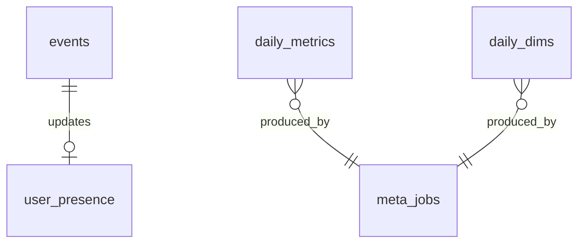

# nongyu-go-track-server 埋点服务技术方案

> 状态：待评审确认  
> 需求归类：基建  
> 部署假设：独立轻量云 **2 核 / 2G 内存 / 40G 磁盘**，仅跑本服务 + SQLite  
> 客户端约定：见 `docs/nongyu-rn-app/技术选型.md` §6（自研 Telemetry、批量 POST、MMKV 重试；禁止商用 SaaS）

---

## 1. 背景与目标

### 1.1 背景

农屿需自研埋点，覆盖：页面浏览、重点按钮、课表/列表性能、在线/日活、JS 故障上报；管理端数据大屏依赖这些数据做趋势与分布分析。

业务库（`nongyu-node-server` + MySQL）专注账号与业务；埋点写入量大、查询偏分析，故独立为 **`nongyu-go-track-server` + SQLite**。

### 1.2 目标

- App 高可靠批量上报（失败可本地重试）
- 在 2C2G40G 上稳定支撑约 5000 注册 / 1000 DAU
- 支撑管理端：日活、在线、页面/按钮频次、性能分位、崩溃列表与趋势
- 原始明细可清理；大屏趋势主要读日聚合

### 1.3 非目标（一期）

- 原生崩溃采集（二期）
- 商用 APM / 第三方埋点
- ClickHouse 等专用 OLAP
- 与业务 MySQL 同库同表
- 实时复杂漏斗/会话重放

---

## 2. 选型结论（存储）

| 项               | 结论                                                                        |
| ---------------- | --------------------------------------------------------------------------- |
| 接入服务         | `nongyu-go-track-server`（Go）                                              |
| 存储             | **嵌入式 SQLite**（数据文件在本机磁盘）                                     |
| 驱动建议         | **`modernc.org/sqlite`（纯 Go）**：运行机无需安装 SQLite 软件包，也无需 CGO |
| 是否另装 DB 服务 | **否**；SQLite 编进二进制，库 = 文件                                        |
| 业务 MySQL       | **不存**埋点原始事件与埋点聚合表                                            |

**为何不用业务 MySQL 扛埋点**：隔离写入与磁盘膨胀，避免分析查询拖慢 OLTP；本机可单独扩容/备份 Track。

**为何一期 SQLite 足够**：预估日事件约 5e4～2e5 行量级（见 §5），远低于 SQLite 舒适区；配合 WAL + 单写队列 + 批量事务即可。

**升级触发（再议迁独立 MySQL 库）**：持续日事件 ≫ 50 万，或大屏查询 P95 长期 > 2s，或需要多实例 Track 水平扩展写。

---

## 3. 总体架构

```text
┌─────────────────┐     batch POST      ┌──────────────────────────┐
│  nongyu-rn-app  │ ──────────────────► │  nongyu-go-track-server  │
│  Telemetry SDK  │                     │  (Go HTTP API)           │
└─────────────────┘                     │         │                │
                                        │         ▼                │
┌─────────────────┐   query (admin)     │   SQLite (WAL)           │
│ nongyu-web-admin│ ─┐                  │   /var/lib/nongyu-track/ │
└─────────────────┘  │                  └────────────┬─────────────┘
                     │                               │
┌─────────────────┐  │  proxy / BFF                  │ 必须：回写在线态
│nongyu-node-server│◄─┘                               │
│ (业务 MySQL)     │ ◄───────────────────────────────┘
└─────────────────┘
```

**推荐流量**：

| 调用方     | 路径                                                                                                                           |
| ---------- | ------------------------------------------------------------------------------------------------------------------------------ |
| App        | 直连 Track 公网域名（或同机反向代理）上报                                                                                      |
| Admin 大屏 | **经 `nongyu-node-server` BFF 代理**查询 Track（统一鉴权、隐藏 Track 内网地址）                                                |
| 在线人数   | **业务库 `users.is_online` 必须可用**；Track 收到心跳后 **必须** 回写 Node（更新在线态），失败应重试；大屏「当前在线」读业务库 |

---

## 4. 运行环境与资源预算（2C2G40G）

| 资源             | 建议占用                                                        |
| ---------------- | --------------------------------------------------------------- |
| Go 进程 RSS      | 目标 &lt; 200MB（无大缓存）                                     |
| SQLite 页缓存    | `PRAGMA cache_size` 约 **-20000**（约 80MB 量级，可按压测下调） |
| OS / 监控 / 日志 | 预留 ≥ 500MB                                                    |
| 磁盘 40G         | 系统+二进制 ~5G；数据+WAL+备份目标占用见 §6；留 ≥ 15G 余量      |

**进程模型**：单实例、单进程；SQLite 写入串行化（应用内 write queue / 单 writer goroutine）。

**反代**：Nginx/Caddy 终止 TLS，反代到 `127.0.0.1:8081`；限制 body 大小（如 1MB）。

---

## 5. 容量与事件估算

| 假设                   | 值                          |
| ---------------------- | --------------------------- |
| DAU                    | 1000                        |
| 人均事件/日            | 50～150（含心跳）           |
| 日增量行数             | ≈ 5万～15万                 |
| 行均体积（含索引粗估） | ≈ 300～600 B                |
| 日磁盘增量             | ≈ 30～90 MB                 |
| 原始保留 30 天         | ≈ 1～3 GB                   |
| 日聚合 400 天          | &lt; 200 MB（通常远小于此） |

40G 盘足够；风险主要在 **未做清理** 或 **崩溃堆栈 props 过大**（需截断）。

---

## 6. 数据保存与生命周期策略

### 6.1 分层存储

| 层          | 内容                           | 保留                     | 用途                                                              |
| ----------- | ------------------------------ | ------------------------ | ----------------------------------------------------------------- |
| L0 原始事件 | `events`                       | **30 天**                | 排查、临时明细、重算聚合                                          |
| L1 日聚合   | `daily_metrics` / `daily_dims` | **400 天（约 13 个月）** | 大屏趋势、分布                                                    |
| L2 在线辅助 | `user_presence`                | 仅当前态                 | Track 侧超时扫描辅助；**业务在线以 MySQL `users` 为准且必须可用** |
| L3 备份     | 每日 `.db` 冷备                | **7～14 份滚动**         | 灾难恢复                                                          |

### 6.2 写入策略

1. 客户端批量上报（建议 20～50 条/批，或每 10～30s flush）。
2. 服务端校验后进入 **单 writer**：`BEGIN IMMEDIATE` → 批量 `INSERT` → `COMMIT`。
3. 心跳：写 `events`（可采样，见下）、upsert `user_presence`，并 **同步调用 Node 内部接口** 更新 `users.is_online=1`、`last_active_at`（失败入重试队列，保证业务表最终正确）。
4. `props_json` **硬上限**（如 4KB）；超长截断并打标 `props_truncated=1`。

**心跳采样（省盘）**：

- 每次心跳都更新 Track 本地 `user_presence`，并触发对 Node 的在线态回写（可合并短时间重复回写，如同一用户 30s 内只打一次 Node）。
- `events` 中 `heartbeat` 可 **每用户每 5 分钟最多落 1 条**（更密的心跳仍更新 presence + 回写 Node，但不插事件）。

### 6.3 聚合策略

| 任务     | 调度                                   | 行为                                                                                              |
| -------- | -------------------------------------- | ------------------------------------------------------------------------------------------------- |
| 日聚合   | 每天 00:10（`Asia/Shanghai` 业务日切） | 聚合「昨日」写入 L1；幂等 upsert                                                                  |
| 补聚合   | 管理端触发或启动时检查空洞             | 按 `stat_date` 重跑                                                                               |
| 原始清理 | 每天 03:00                             | `DELETE FROM events WHERE created_at < now-30d`；再 `PRAGMA optimize` / 周期性 `VACUUM`（见下）   |
| 在线超时 | 每 1 分钟                              | Track 将本地超时用户置离线，并 **回调 Node** 将对应 `users.is_online=0`（建议阈值 10 分钟无心跳） |

**业务日**：聚合键 `stat_date` 使用 **Asia/Shanghai** 日历日；库内时间戳仍存 **UTC**（`TEXT` ISO8601 或整数 Unix ms，见 §8）。

### 6.4 VACUUM 策略

- 日常：`DELETE` 后执行 `PRAGMA optimize`（轻量）。
- 每周一次低峰：`VACUUM INTO 'backup-compact.db'` 或在线 `VACUUM`（会锁库，选 04:00，并暂停写入数秒～数分钟）。
- 避免高峰对 2G 机做全库 VACUUM。

### 6.5 备份与恢复

```text
/var/lib/nongyu-track/
  track.db
  track.db-wal
  track.db-shm
/var/backups/nongyu-track/
  track-YYYYMMDD.db   # 推荐使用 SQLite backup API / VACUUM INTO 得到一致快照
```

- 每日备份；保留 7～14 天；备份失败告警（日志/邮件即可）。
- **禁止**在 WAL 模式下直接冷拷贝 `track.db` 而不停写或不走 backup API。

---

## 7. SQLite 运行参数（建议）

应用启动时设置：

| PRAGMA         | 建议值     | 说明                         |
| -------------- | ---------- | ---------------------------- |
| `journal_mode` | `WAL`      | 读写并发更好                 |
| `synchronous`  | `NORMAL`   | 性能与安全折中               |
| `busy_timeout` | `5000`     | ms，配合单 writer 仍建议设置 |
| `foreign_keys` | `ON`       |                              |
| `temp_store`   | `MEMORY`   |                              |
| `cache_size`   | `-20000`   | 可按内存压测调整为 -10000    |
| `mmap_size`    | `67108864` | 64MB，2G 机谨慎，可降为 0    |

连接：写连接 1 条长连接；只读查询可用另开只读连接（`mode=ro`）减轻阻塞。

---

## 8. 数据库设计（SQLite）

### 8.1 ER 概览



### 8.2 表：`events`（原始事件）

| 列               | 类型    | 约束            | 说明                                       |
| ---------------- | ------- | --------------- | ------------------------------------------ |
| `id`             | INTEGER | PK AI           |                                            |
| `event_id`       | TEXT    | UNIQUE NOT NULL | 客户端生成 UUID，幂等去重                  |
| `user_id`        | INTEGER | NULL            | 业务用户 id；未登录可空                    |
| `student_no`     | TEXT    | NULL            | 可选冗余，便于排障（9 位）；非必须         |
| `event_type`     | TEXT    | NOT NULL        | 见枚举                                     |
| `event_name`     | TEXT    | NOT NULL        | 页面路由名 / 按钮名 / 性能名 / 错误名      |
| `app_version`    | TEXT    | NULL            |                                            |
| `platform`       | TEXT    | NULL            | `ios` / `android`                          |
| `device_brand`   | TEXT    | NULL            |                                            |
| `session_id`     | TEXT    | NULL            | 一次冷启动会话                             |
| `duration_ms`    | INTEGER | NULL            | 性能耗时                                   |
| `props_json`     | TEXT    | NULL            | JSON 对象字符串，≤4KB                      |
| `client_ts_ms`   | INTEGER | NULL            | 客户端事件时间 UTC ms                      |
| `received_at_ms` | INTEGER | NOT NULL        | 服务端接收 UTC ms                          |
| `stat_date`      | TEXT    | NOT NULL        | `YYYY-MM-DD`（上海时区业务日，入库时计算） |

**event_type 枚举**：

| 值             | 来源               | 说明                          |
| -------------- | ------------------ | ----------------------------- |
| `screen_view`  | 路由自动           | 页面进入（对齐 RN 选型命名）  |
| `button_click` | 封装组件           | 重点按钮                      |
| `perf`         | measure            | 课表渲染、列表耗时等          |
| `app_open`     | SDK                | 冷/热启动，支撑 DAU           |
| `heartbeat`    | SDK                | 在线心跳（可降采样落 events） |
| `crash`        | ErrorBoundary/全局 | JS 异常                       |

**索引**：

- `UNIQUE(event_id)`
- `(stat_date, event_type)`
- `(stat_date, event_name)`
- `(user_id, stat_date)`
- `(received_at_ms)`（清理用）

### 8.3 表：`user_presence`（Track 本地辅助）

| 列                | 类型    | 说明     |
| ----------------- | ------- | -------- |
| `user_id`         | INTEGER | PK       |
| `is_online`       | INTEGER | 0/1      |
| `last_seen_at_ms` | INTEGER | 最近心跳 |
| `platform`        | TEXT    |          |
| `app_version`     | TEXT    |          |
| `device_brand`    | TEXT    |          |
| `updated_at_ms`   | INTEGER |          |

用于 Track 侧超时扫描与 `online_peak` 采样；**不替代**业务库在线字段。

**与业务库关系**：不分「权威/镜像」。业务侧 `users.is_online` / `last_active_at` **必须可用**；Track 在心跳上线、超时/显式离线时 **必须** 调用 Node 内部接口回写，失败重试，不得以「可选」为由跳过。

### 8.4 表：`daily_metrics`（无维度日指标）

| 列                                     | 说明                                                        |
| -------------------------------------- | ----------------------------------------------------------- |
| `stat_date`                            | `YYYY-MM-DD`                                                |
| `metric_key`                           | 如 `dau` / `app_open_count` / `crash_count` / `online_peak` |
| `metric_value`                         | INTEGER                                                     |
| PRIMARY KEY(`stat_date`, `metric_key`) |                                                             |

建议 `metric_key`：

| key                  | 计算                                                                                        |
| -------------------- | ------------------------------------------------------------------------------------------- |
| `dau`                | 当日有 `app_open` 或任意事件的去重 `user_id` 数（推荐以 `app_open` 为主口径，文档写死一种） |
| `app_open_count`     | `app_open` 次数                                                                             |
| `screen_view_count`  | 页面浏览次数                                                                                |
| `button_click_count` | 点击次数                                                                                    |
| `crash_count`        | 崩溃事件数                                                                                  |
| `online_peak`        | 当日定时采样在线人数的峰值                                                                  |

**DAU 口径（锁定）**：当日 `stat_date` 下，存在至少 1 条 `event_type='app_open'` 且 `user_id IS NOT NULL` 的去重用户数。

### 8.5 表：`daily_dims`（带维度日指标）

| 列                                                          | 说明                                                          |
| ----------------------------------------------------------- | ------------------------------------------------------------- |
| `stat_date`                                                 |                                                               |
| `metric_key`                                                | 如 `screen_views` / `button_clicks` / `perf_p50` / `perf_p95` |
| `dim_key`                                                   | 如 `name`（event_name）/ `platform`                           |
| `dim_value`                                                 |                                                               |
| `metric_value`                                              |                                                               |
| PRIMARY KEY(`stat_date`,`metric_key`,`dim_key`,`dim_value`) |                                                               |

性能：对 `event_type='perf'` 按 `event_name` 聚合 `duration_ms` 的 p50/p95（可用近似：排序分位或 t-digest 二期；一期可用 SQL 窗口/应用侧算）。

### 8.6 表：`meta_jobs`

| 列                                | 说明                               |
| --------------------------------- | ---------------------------------- |
| `job_name`                        | `aggregate_daily` / `purge_events` |
| `job_key`                         | 如 `stat_date=2026-08-09`          |
| `status`                          | `success` / `failed`               |
| `finished_at_ms`                  |                                    |
| `detail_json`                     | 错误信息等                         |
| PRIMARY KEY(`job_name`,`job_key`) |                                    |

### 8.7 DDL（SQLite）

```sql
PRAGMA foreign_keys = ON;

CREATE TABLE events (
  id INTEGER PRIMARY KEY AUTOINCREMENT,
  event_id TEXT NOT NULL,
  user_id INTEGER NULL,
  student_no TEXT NULL,
  event_type TEXT NOT NULL,
  event_name TEXT NOT NULL,
  app_version TEXT NULL,
  platform TEXT NULL,
  device_brand TEXT NULL,
  session_id TEXT NULL,
  duration_ms INTEGER NULL,
  props_json TEXT NULL,
  client_ts_ms INTEGER NULL,
  received_at_ms INTEGER NOT NULL,
  stat_date TEXT NOT NULL,
  CHECK (event_type IN ('screen_view','button_click','perf','app_open','heartbeat','crash')),
  CHECK (platform IS NULL OR platform IN ('ios','android'))
);

CREATE UNIQUE INDEX uk_events_event_id ON events(event_id);
CREATE INDEX idx_events_stat_type ON events(stat_date, event_type);
CREATE INDEX idx_events_stat_name ON events(stat_date, event_name);
CREATE INDEX idx_events_user_stat ON events(user_id, stat_date);
CREATE INDEX idx_events_received ON events(received_at_ms);

CREATE TABLE user_presence (
  user_id INTEGER PRIMARY KEY,
  is_online INTEGER NOT NULL DEFAULT 0 CHECK (is_online IN (0,1)),
  last_seen_at_ms INTEGER NOT NULL,
  platform TEXT NULL,
  app_version TEXT NULL,
  device_brand TEXT NULL,
  updated_at_ms INTEGER NOT NULL
);

CREATE INDEX idx_presence_online_seen ON user_presence(is_online, last_seen_at_ms);

CREATE TABLE daily_metrics (
  stat_date TEXT NOT NULL,
  metric_key TEXT NOT NULL,
  metric_value INTEGER NOT NULL DEFAULT 0,
  updated_at_ms INTEGER NOT NULL,
  PRIMARY KEY (stat_date, metric_key)
);

CREATE TABLE daily_dims (
  stat_date TEXT NOT NULL,
  metric_key TEXT NOT NULL,
  dim_key TEXT NOT NULL,
  dim_value TEXT NOT NULL,
  metric_value INTEGER NOT NULL DEFAULT 0,
  updated_at_ms INTEGER NOT NULL,
  PRIMARY KEY (stat_date, metric_key, dim_key, dim_value)
);

CREATE TABLE meta_jobs (
  job_name TEXT NOT NULL,
  job_key TEXT NOT NULL,
  status TEXT NOT NULL,
  finished_at_ms INTEGER NOT NULL,
  detail_json TEXT NULL,
  PRIMARY KEY (job_name, job_key)
);
```

---

## 9. 接口设计

统一约定：

- Base path：`/v1`
- JSON；时间对外可用 ISO8601，库内 ms
- 成功：`{ "ok": true, "data": ... }`
- 失败：`{ "ok": false, "error": { "code": "...", "message": "..." } }`

### 9.1 鉴权

| 接口类     | 鉴权                                                                                                                                                                                    |
| ---------- | --------------------------------------------------------------------------------------------------------------------------------------------------------------------------------------- |
| App 上报   | `Authorization: Bearer <App JWT>`（与业务签发 **同一套密钥/issuer**，校验 `uid` + `token_version` 可选简化为只验签名与过期；`token_version` 严格校验需调 Node，一期可只验签名+exp+uid） |
| Admin 查询 | **禁止公网直暴露**；仅 Node BFF 携带 `X-Internal-Token` 访问，或 Track 只监听内网                                                                                                       |
| 内部回写   | Node 提供内部接口；Track 配 `INTERNAL_TOKEN`                                                                                                                                            |

**一期 JWT 建议**：Track 本地校验 JWT（共享 `JWT_SECRET`），信任 `sub`/`uid` 为 `user_id`；登出踢下线造成的「已作废 token 仍可上报」可接受（埋点非高敏感），或缓存 `token_version` 由 Node 推送（二期）。

### 9.2 App：批量上报

`POST /v1/track/events`

**Request**

```json
{
  "events": [
    {
      "event_id": "550e8400-e29b-41d4-a716-446655440000",
      "event_type": "screen_view",
      "event_name": "timetable",
      "client_ts_ms": 1765100000000,
      "session_id": "sess_xxx",
      "app_version": "4.0.1",
      "platform": "android",
      "device_brand": "xiaomi",
      "duration_ms": null,
      "props": { "from": "tab" }
    }
  ]
}
```

**规则**：

- `events.length`：1～100；超限 400
- 服务端强制写入 `user_id`（来自 JWT），忽略客户端伪造的 user_id
- 重复 `event_id`：忽略（幂等），不计失败
- 单条校验失败：计入 `rejected`，其余尽量写入（部分成功）

**Response**

```json
{
  "ok": true,
  "data": {
    "accepted": 18,
    "duplicated": 1,
    "rejected": 1,
    "errors": [{ "event_id": "...", "code": "INVALID_TYPE" }]
  }
}
```

**副作用**：

- `heartbeat` / `app_open` / 任意带鉴权事件：upsert `user_presence.is_online=1`，并触发对 Node 的在线态回写
- 客户端应在进程退出前尽量 `flush` / 调离线接口；无法保证时靠超时回写 `users.is_online=0`

### 9.3 App：显式离线（可选）

`POST /v1/track/presence/offline`

退出登录或 App 即将被杀前尽力调用；失败则依赖 10 分钟超时。

### 9.4 Admin / BFF：概览指标

`GET /v1/admin/overview?date=2026-08-10`

**Response `data`**

```json
{
  "date": "2026-08-10",
  "dau": 860,
  "online": 120,
  "crash_count": 3,
  "app_open_count": 1400,
  "screen_view_count": 22000
}
```

说明：`online` **由 Node 读业务 `users.is_online` 填入**（本接口可只返回 Track 侧指标，或 `online` 字段省略由 BFF 拼装）；其余优先读 `daily_metrics`，若查「今天」且聚合未出，可走 events 实时近似（限流）。

### 9.5 Admin：趋势

`GET /v1/admin/metrics/trend?metric=dau&from=2026-07-01&to=2026-08-10`

返回 `[{ "date": "...", "value": 123 }, ...]`，读 `daily_metrics`。

允许 `metric`：`dau` | `crash_count` | `app_open_count` | `screen_view_count` | `online_peak`。

### 9.6 Admin：维度分布

`GET /v1/admin/metrics/dims?metric=screen_views&date=2026-08-10&limit=50`

读 `daily_dims`（`metric_key=screen_views`, `dim_key=name`）。

同类：`button_clicks`、`perf_p95`（`dim_key=name`）。

### 9.7 Admin：崩溃列表

`GET /v1/admin/crashes?from=...&to=...&page=1&page_size=20`

查 `events` where `event_type='crash'`，返回截断后的 `props`（message/stack）。

### 9.8 Admin：补聚合 / 运维

`POST /v1/admin/jobs/aggregate` body: `{ "stat_date": "2026-08-09" }`  
`POST /v1/admin/jobs/purge`（手动触发清理，仍受保留策略约束）

仅内部 Token。

### 9.9 Node BFF 映射建议

| 管理端需求                                     | Node 聚合方式                                   |
| ---------------------------------------------- | ----------------------------------------------- |
| 总用户 / 新增 / 当前在线 / 学院分布 / 设置分布 | 业务 MySQL（在线：`COUNT` where `is_online=1`） |
| DAU / 行为 / 性能 / 崩溃 / online_peak 趋势    | 代理 Track `/v1/admin/*`                        |
| 大屏单接口                                     | Node 并行拉 MySQL + Track 后拼装                |

---

## 10. 服务端模块划分（Go）

```text
cmd/track-server/main.go
internal/
  config/
  httpapi/          # 路由与中间件（鉴权、限流、body limit）
  ingest/           # 校验、幂等、presence
  store/sqlite/     # DB、PRAGMA、backup
  aggregate/        # 日聚合与清理
  presence/         # 超时扫描 + 回写 Node
  auth/jwt/
  usersync/         # 必须：回写 Node users.is_online / last_active_at
```

**技术组件建议**：

| 组件   | 建议                                                                             |
| ------ | -------------------------------------------------------------------------------- |
| HTTP   | `net/http` + 轻量路由，或 `chi` / `echo`（择一，保持依赖少）                     |
| SQLite | `modernc.org/sqlite` + `database/sql`                                            |
| 配置   | 环境变量：`HTTP_ADDR` `DB_PATH` `JWT_SECRET` `INTERNAL_TOKEN` `TZ=Asia/Shanghai` |
| 日志   | slog JSON                                                                        |
| 限流   | 按 IP + 按 user_id 的简单 token bucket（内存）                                   |

---

## 11. 可靠性与安全

| 项   | 策略                                             |
| ---- | ------------------------------------------------ |
| 幂等 | `event_id` UNIQUE                                |
| 背压 | 写入队列长度上限；超过返回 503，客户端 MMKV 重试 |
| 限流 | 单用户如 120 req/min；单 IP 更高一点             |
| Body | ≤ 1MB                                            |
| SQL  | 仅预编译语句                                     |
| 隐私 | props 禁止明文密码；学号可选且最小化             |
| TLS  | 反代终止                                         |

---

## 12. 部署清单（本机）

1. 创建用户与目录：`/var/lib/nongyu-track`、`/var/backups/nongyu-track`
2. systemd 托管 `nongyu-track`，`Restart=always`，内存 `MemoryMax=512M`（可调）
3. Nginx 反代 + HTTPS
4. cron：备份脚本（调用服务 backup 接口或 `sqlite3 .backup`）
5. 日志轮转：journald 或 Loki 免装，先本地文件轮转

**同机是否再跑业务**：本方案按 **Track 专用机** 设计。若被迫与 Node/MySQL 同机，必须下调 SQLite `cache_size`，并严控 MySQL `innodb_buffer_pool`（例如 256～512MB），避免 2G OOM。

---

## 13. 与现有文档的关系

| 文档                                        | 关系                                                                                       |
| ------------------------------------------- | ------------------------------------------------------------------------------------------ |
| `docs/nongyu-rn-app/技术选型.md` §6         | 客户端侧已定；本文件补齐服务端落点                                                         |
| `docs/nongyu-node-server/数据库设计文档.md` | **不再包含埋点表**；`users.is_online` 为正式可用字段，Track 心跳须回写                     |
| 埋点 PRD                                    | 行为/性能/错误由本服务覆盖；在线态落在业务用户表并保持可用；「用户建议反馈」走业务广场帖子 |

---

## 14. 验收标准（方案级）

- [ ] App 批量上报成功；断网重试不丢（客户端 MMKV + 服务端幂等）
- [ ] 管理端可查当日 DAU、当前在线（业务 `users.is_online`）、近 7/30 日趋势
- [ ] 心跳/超时后业务库在线态与真实情况一致（回写失败有重试）
- [ ] 页面/按钮 TopN、课表 perf p95、崩溃列表可用
- [ ] 原始事件 30 天后自动减少；磁盘不无限涨
- [ ] 2C2G 上常驻内存可控，写入高峰无长时间锁死（P99 上报 &lt; 500ms，可压测校准）

---

## 15. 待你确认的假设（若无异议即按此执行）

1. Track **专用** 2C2G40G；业务 MySQL 在其他实例（或同机但接受资源争用风险）。
2. DAU 口径 = 当日去重 `app_open`。
3. 原始 30 天 / 聚合 400 天 / 备份 7～14 天。
4. Admin 查询经 Node BFF，不把 Track Admin API 暴露公网。
5. 一期 JWT 只验签名与 `uid`，不强制实时 `token_version`。
6. **在线态**：业务 `users.is_online` 必须可用；Track 负责采集心跳并回写 Node，不做「权威/镜像」二分。

---

## 16. 变更记录

| 日期       | 说明                                                             |
| ---------- | ---------------------------------------------------------------- |
| 2026-08-10 | 初稿：Go + SQLite 全链路技术方案（保存策略 / 库表 / API / 部署） |
| 2026-08-11 | 在线态改为业务 `users` 必须可用；Track 回写由可选改为必须        |
