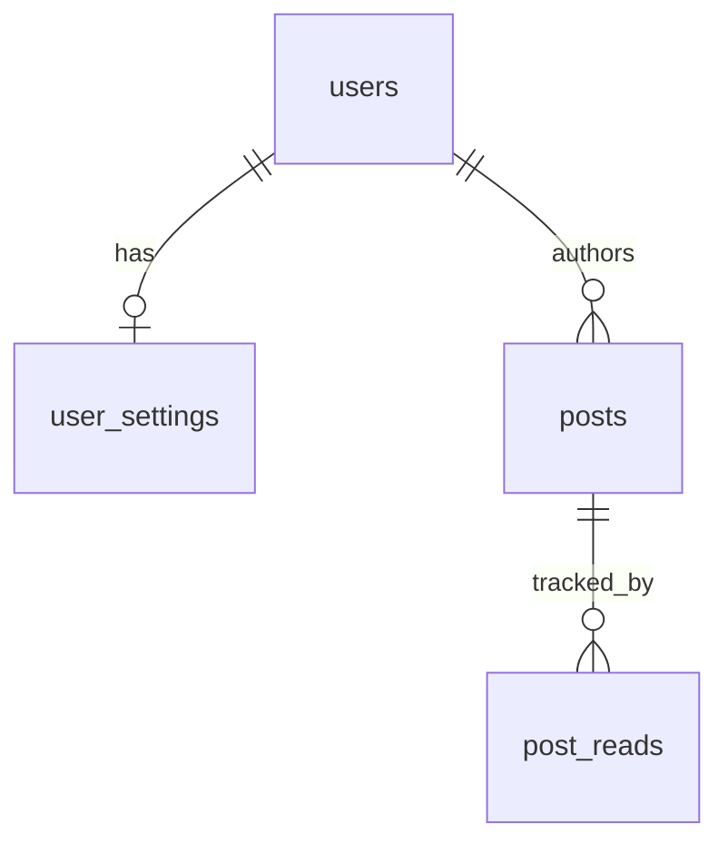

# nongyu-node-server 数据库设计文档

> 状态：待评审确认  
> 数据库：MySQL（InnoDB / utf8mb4）  
> 驱动约定：`mysql2`（见全局技术选型）  
> 规模假设：注册用户约 5000，单机约 2G 内存 / 4G 磁盘  
> 学号约定：固定 **9 位数字**（`CHAR(9)`）

---

## 1. 背景与目标

### 1.1 背景

`nongyu-node-server` 为农屿单体后端，需同时服务：

- `nongyu-rn-app`（学生端）
- `nongyu-web-admin`（管理端）

教务 / 二课业务数据以实时代理为主，不作为本库主数据；本库负责农屿自身账号、会话校验、广场内容与 App 版本管理等持久化。

**埋点后置**：行为/性能/崩溃等埋点数据不在本库建模，由独立服务 `nongyu-go-track-server`（Go + SQLite）承担，详见 `docs/nongyu-go-track-server/tech/埋点服务技术方案.md`。用户在线态以本库 `users` 为准并须保持可用（心跳路径须回写本表，见 Track 方案）。

**课表后置**：课表课程/日程/考勤/待办/备注/分享等服务端表结构本版不建模，后续单独设计；`user_settings` 中与课表 UI 相关的偏好字段可保留（设置同步 / 大屏分布）。

### 1.2 目标

- 支撑登录即注册、单设备登录、管理员角色与农屿管理员密码
- 支撑广场（公告 / 反馈墙 / 大院）、阅读量与覆盖率
- 支撑 App 版本管理
- 管理端大屏中的「用户档案/设置分布」等业务指标；DAU/行为/性能/崩溃等走 Track

### 1.3 非目标（本版不建表）

- 课表领域表（`timetable_*` / `course_*` 等，后续再设计）
- 首页常用网站（前端硬编码，不建 `site_links`）
- `system_configs`（公众号/QQ 群等展示信息由前端或其他渠道维护，本库不建）
- 埋点原始事件、埋点日聚合表（归 Track）
- Agent 对话历史、管理端智慧助手会话
- QQ 成绩推送绑定 / 消息队列
- 教务成绩 / 排名 / 考试安排 / 培养方案等业务快照（实时查询）
- 二课活动 / 学分等业务快照（实时查询）
- Redis 或其他独立会话存储

---

## 2. 设计约定（已对齐）

| 项            | 约定                                                                                    |
| ------------- | --------------------------------------------------------------------------------------- |
| 需求归类      | 基建需求（后端数据模型）                                                                |
| 范围          | 本期：用户 / 广场 / App 版本；课表与埋点后置                                            |
| 课表          | **本版不建表**；后续单独设计                                                            |
| 管理员        | 与学生同表：`role` + `admin_password_hash`                                              |
| 埋点          | **不在本库**；见 go-track 技术方案                                                      |
| App 会话      | 无独立 session 表；JWT + `users.token_version` / `current_device_id`                    |
| 删除          | 帖子等业务内容软删；会话靠版本号失效                                                    |
| 在线态        | `users.is_online` / `last_active_at` 为正式可用字段；登录、登出、心跳、超时均须正确维护 |
| 主键          | `BIGINT` 自增；学号为业务唯一键，不作物理主键                                           |
| 字符集 / 引擎 | `utf8mb4` + `InnoDB`                                                                    |
| 时间          | `DATETIME(3)`，应用层按 **UTC** 读写                                                    |
| 学号          | 9 位数字，`CHAR(9)`                                                                     |

---

## 3. 领域总览



### 表清单

| 领域 | 表名            | 说明                                                      |
| ---- | --------------- | --------------------------------------------------------- |
| 用户 | `users`         | 学生档案、角色、在线态、设备、Token 版本                  |
| 用户 | `user_settings` | 主题与 App 设置（同步服务端，供大屏分布；含课表 UI 偏好） |
| 广场 | `posts`         | 公告 / 反馈 / 大院统一帖子                                |
| 广场 | `post_reads`    | 帖子唯一阅读记录（覆盖率）                                |
| 运营 | `app_versions`  | App 版本发布                                              |

---

## 4. 表结构设计

### 4.1 `users` — 用户主表

**用途**：登录即注册；管理端用户管理；大屏用户分布 / 在线 / 新增；单设备踢下线。

| 字段                  | 类型         | 约束               | 说明                                                   |
| --------------------- | ------------ | ------------------ | ------------------------------------------------------ |
| `id`                  | BIGINT       | PK AI              | 内部主键                                               |
| `student_no`          | CHAR(9)      | UNIQUE NOT NULL    | 学号，9 位数字                                         |
| `name`                | VARCHAR(64)  | NOT NULL           | 姓名                                                   |
| `major`               | VARCHAR(128) | NULL               | 专业                                                   |
| `college`             | VARCHAR(128) | NULL               | 学院                                                   |
| `class_name`          | VARCHAR(128) | NULL               | 班级                                                   |
| `grade`               | VARCHAR(32)  | NULL               | 年级，如 `2023级`                                      |
| `gender`              | TINYINT      | NOT NULL DEFAULT 0 | 0未知 1男 2女                                          |
| `hometown`            | VARCHAR(64)  | NULL               | 生源地                                                 |
| `campus`              | VARCHAR(64)  | NULL               | 校区（大屏分布）                                       |
| `qq`                  | VARCHAR(20)  | NULL               | 用户可编辑                                             |
| `role`                | TINYINT      | NOT NULL DEFAULT 0 | 0普通用户 1管理员                                      |
| `admin_password_hash` | VARCHAR(255) | NULL               | 农屿管理员密码哈希；普通用户必须为 NULL                |
| `status`              | TINYINT      | NOT NULL DEFAULT 1 | 1正常 0禁用                                            |
| `is_online`           | TINYINT(1)   | NOT NULL DEFAULT 0 | 是否在线（含挂后台；管理端「当前在线」直接统计本字段） |
| `last_active_at`      | DATETIME(3)  | NULL               | 最近活跃时间（心跳/打开 App 等更新）                   |
| `last_login_at`       | DATETIME(3)  | NULL               | 最近登录                                               |
| `device_brand`        | VARCHAR(64)  | NULL               | 设备品牌（苹果/小米等）                                |
| `device_model`        | VARCHAR(128) | NULL               | 设备型号                                               |
| `device_os`           | VARCHAR(64)  | NULL               | 系统版本，如 `Android 13.0.0`                          |
| `current_device_id`   | VARCHAR(128) | NULL               | 当前合法设备标识                                       |
| `token_version`       | INT          | NOT NULL DEFAULT 0 | 登录/登出/被踢时递增；JWT 内嵌同值校验                 |
| `created_at`          | DATETIME(3)  | NOT NULL           | 账号创建时间                                           |
| `updated_at`          | DATETIME(3)  | NOT NULL           | 更新时间                                               |

**索引**：`uk_student_no`；`idx_role_status`；`idx_created_at`；`idx_is_online`；`idx_college`；`idx_grade`；`idx_campus`；`idx_gender`；`idx_device_brand`；`idx_last_active_at`。

**业务规则**：

- 不存教务密码。
- 新设备登录成功：更新 `current_device_id` / 设备字段，并 `token_version = token_version + 1`，使旧 JWT 失效；`is_online = 1`，刷新 `last_active_at` / `last_login_at`。
- 主动登出：`is_online = 0`，`token_version` 递增。
- 心跳（经 Track 上报后回写 Node，或 Node 直收）：`is_online = 1`，刷新 `last_active_at`。
- 超时离线：超过约定无心跳窗口（建议 10 分钟）将 `is_online = 0`（可由 Node 定时任务或 Track 回调触发，须保证本表最终正确）。
- `role = 1` 时才允许设置/校验 `admin_password_hash`；管理端可多端同时登录（不依赖 `token_version` 踢管理端，管理端 JWT 策略与 App 分离或忽略单设备字段）。

---

### 4.2 `user_settings` — 用户设置

**用途**：设置页同步；大屏「用户设置项分布」。  
**安全**：大模型 API Key **不落库**，仅保留本地。  
**说明**：下列 `home_is_timetable` / 课表配色 / 开学日期 / 背景等为 **UI 偏好**，不代表课表业务数据已落库；课程/日程等表后置设计。

| 字段                        | 类型         | 约束                           | 说明                                              |
| --------------------------- | ------------ | ------------------------------ | ------------------------------------------------- |
| `id`                        | BIGINT       | PK AI                          |                                                   |
| `user_id`                   | BIGINT       | UNIQUE FK → users.id           | 一对一                                            |
| `theme`                     | VARCHAR(32)  | NOT NULL DEFAULT `sicau_green` | `sicau_green` / `sakura_pink` / `dark` / `system` |
| `home_is_timetable`         | TINYINT(1)   | NOT NULL DEFAULT 0             | 首屏是否课表                                      |
| `open_web_in_app`           | TINYINT(1)   | NOT NULL DEFAULT 1             | 是否内置浏览器打开网页                            |
| `agent_enabled`             | TINYINT(1)   | NOT NULL DEFAULT 1             | 是否启用 Agent                                    |
| `highlight_today_column`    | TINYINT(1)   | NOT NULL DEFAULT 1             | 是否高亮当日列                                    |
| `course_card_color_mode`    | VARCHAR(16)  | NOT NULL DEFAULT `distinct`    | `distinct` 分色 / `unified` 统一色                |
| `course_card_unified_color` | VARCHAR(32)  | NULL                           | 统一色值                                          |
| `semester_start_date`       | DATE         | NULL                           | 用户设置的开学日期                                |
| `timetable_bg_uri`          | VARCHAR(512) | NULL                           | 课表背景（本地 URI 或可访问 URL）                 |
| `created_at` / `updated_at` | DATETIME(3)  | NOT NULL                       |                                                   |

---

### 4.3 `posts` — 广场统一帖子

`post_type`：

| 值             | 含义     | 作者                 | 客户端展示 |
| -------------- | -------- | -------------------- | ---------- |
| `announcement` | 农屿公告 | 管理员               | 只读       |
| `feedback`     | 反馈墙   | 用户（App 展示匿名） | 可读可写   |
| `courtyard`    | 农屿大院 | 用户（App 展示匿名） | 可读可写   |

> App 列表/详情不下发作者姓名/学号/userId；管理端接口可查 `authorName` / `authorStudentNo`。

| 字段                        | 类型         | 约束               | 说明                                                                                    |
| --------------------------- | ------------ | ------------------ | --------------------------------------------------------------------------------------- |
| `id`                        | BIGINT       | PK AI              |                                                                                         |
| `post_type`                 | VARCHAR(32)  | NOT NULL           | 见上                                                                                    |
| `subtype`                   | VARCHAR(32)  | NOT NULL           | 公告：`system`/`activity` 等；反馈：`feedback`/`suggestion`/`bug`；大院：自定义类型标签 |
| `title`                     | VARCHAR(200) | NOT NULL           |                                                                                         |
| `content`                   | MEDIUMTEXT   | NOT NULL           | 富文本（本版不含图音）                                                                  |
| `author_user_id`            | BIGINT       | FK → users.id      | 公告可为管理员；反馈/大院必填以便「我的帖子」                                           |
| `view_count`                | INT          | NOT NULL DEFAULT 0 | 详情打开总次数                                                                          |
| `unique_reader_count`       | INT          | NOT NULL DEFAULT 0 | 唯一读者数（覆盖率 = 该值 / 总用户数）                                                  |
| `deleted_at`                | DATETIME(3)  | NULL               | 软删                                                                                    |
| `published_at`              | DATETIME(3)  | NOT NULL           | 列表默认按此倒序                                                                        |
| `created_at` / `updated_at` | DATETIME(3)  | NOT NULL           |                                                                                         |

**索引**：`idx_type_published (post_type, published_at)`；`idx_author (author_user_id, published_at)`；`idx_deleted_published (deleted_at, published_at)`。

**规则**：不支持评论 / 点赞 / 用户编辑已发帖；作者可软删自己的帖；管理员可删/编辑公告。

---

### 4.4 `post_reads` — 唯一阅读

| 字段            | 类型        | 约束                            | 说明 |
| --------------- | ----------- | ------------------------------- | ---- |
| `id`            | BIGINT      | PK AI                           |      |
| `post_id`       | BIGINT      | FK → posts.id ON DELETE CASCADE |      |
| `user_id`       | BIGINT      | FK → users.id                   |      |
| `first_read_at` | DATETIME(3) | NOT NULL                        |      |

**唯一约束**：`uk_post_user (post_id, user_id)`。  
首次插入成功时：`posts.view_count++` 且 `unique_reader_count++`；若已存在则仅 `view_count++`（重复打开也计总阅读，不增覆盖人数）。

---

### 4.5 `app_versions` — 版本管理

| 字段              | 说明                                               |
| ----------------- | -------------------------------------------------- |
| `platform`        | `ios` / `android` / `all`                          |
| `version_name`    | 如 `4.0.1`                                         |
| `version_code`    | INT，可比较                                        |
| `release_channel` | `silent_ota`（静默 JS） / `native`（需重装或整包） |
| `force_update`    | TINYINT(1)                                         |
| `download_url`    | 下载/热更地址                                      |
| `changelog`       | TEXT                                               |
| `is_published`    | TINYINT(1)                                         |
| `published_at`    | DATETIME(3) NULL                                   |

客户端用本地 `version_code` 与最新已发布记录比较。

---

## 5. 关键访问模式（索引依据）

| 场景         | 主要访问                                                              |
| ------------ | --------------------------------------------------------------------- |
| App 登录     | `users` by `student_no`；更新设备与 `token_version`                   |
| JWT 校验     | 解析 `uid` + `token_version`，对齐 `users`                            |
| 我的帖子     | `posts` by `author_user_id` + `deleted_at IS NULL`                    |
| 广场列表     | `posts` by `post_type` + `published_at DESC`                          |
| 覆盖率       | `unique_reader_count` / `COUNT(users)`                                |
| 大屏业务指标 | `users` 计数/分布/当前在线 + `user_settings`；DAU/行为/崩溃等走 Track |
| 设置分布     | `user_settings` GROUP BY 字段                                         |
| 版本检查     | `app_versions` 最新已发布                                             |

---

## 6. 完整 DDL（MySQL 8+）

```sql
-- nongyu-node-server initial schema
-- charset: utf8mb4 / engine: InnoDB
-- time columns: DATETIME(3), application uses UTC

CREATE DATABASE IF NOT EXISTS nongyu
  DEFAULT CHARACTER SET utf8mb4
  DEFAULT COLLATE utf8mb4_unicode_ci;

USE nongyu;

-- ----------------------------
-- users
-- ----------------------------
CREATE TABLE users (
  id BIGINT NOT NULL AUTO_INCREMENT,
  student_no CHAR(9) NOT NULL COMMENT '学号，9位数字',
  name VARCHAR(64) NOT NULL,
  major VARCHAR(128) NULL,
  college VARCHAR(128) NULL,
  class_name VARCHAR(128) NULL,
  grade VARCHAR(32) NULL,
  gender TINYINT NOT NULL DEFAULT 0 COMMENT '0未知 1男 2女',
  hometown VARCHAR(64) NULL,
  campus VARCHAR(64) NULL,
  qq VARCHAR(20) NULL,
  role TINYINT NOT NULL DEFAULT 0 COMMENT '0用户 1管理员',
  admin_password_hash VARCHAR(255) NULL,
  status TINYINT NOT NULL DEFAULT 1 COMMENT '1正常 0禁用',
  is_online TINYINT(1) NOT NULL DEFAULT 0,
  last_active_at DATETIME(3) NULL,
  last_login_at DATETIME(3) NULL,
  device_brand VARCHAR(64) NULL,
  device_model VARCHAR(128) NULL,
  device_os VARCHAR(64) NULL,
  current_device_id VARCHAR(128) NULL,
  token_version INT NOT NULL DEFAULT 0,
  created_at DATETIME(3) NOT NULL DEFAULT CURRENT_TIMESTAMP(3),
  updated_at DATETIME(3) NOT NULL DEFAULT CURRENT_TIMESTAMP(3) ON UPDATE CURRENT_TIMESTAMP(3),
  PRIMARY KEY (id),
  UNIQUE KEY uk_users_student_no (student_no),
  KEY idx_users_role_status (role, status),
  KEY idx_users_created_at (created_at),
  KEY idx_users_is_online (is_online),
  KEY idx_users_college (college),
  KEY idx_users_grade (grade),
  KEY idx_users_campus (campus),
  KEY idx_users_gender (gender),
  KEY idx_users_device_brand (device_brand),
  KEY idx_users_last_active_at (last_active_at),
  CONSTRAINT chk_users_student_no CHECK (student_no REGEXP '^[0-9]{9}$'),
  CONSTRAINT chk_users_gender CHECK (gender IN (0, 1, 2)),
  CONSTRAINT chk_users_role CHECK (role IN (0, 1)),
  CONSTRAINT chk_users_status CHECK (status IN (0, 1))
) ENGINE=InnoDB DEFAULT CHARSET=utf8mb4 COLLATE=utf8mb4_unicode_ci;

-- ----------------------------
-- user_settings
-- ----------------------------
CREATE TABLE user_settings (
  id BIGINT NOT NULL AUTO_INCREMENT,
  user_id BIGINT NOT NULL,
  theme VARCHAR(32) NOT NULL DEFAULT 'sicau_green',
  home_is_timetable TINYINT(1) NOT NULL DEFAULT 0,
  open_web_in_app TINYINT(1) NOT NULL DEFAULT 1,
  agent_enabled TINYINT(1) NOT NULL DEFAULT 1,
  highlight_today_column TINYINT(1) NOT NULL DEFAULT 1,
  course_card_color_mode VARCHAR(16) NOT NULL DEFAULT 'distinct',
  course_card_unified_color VARCHAR(32) NULL,
  semester_start_date DATE NULL,
  timetable_bg_uri VARCHAR(512) NULL,
  created_at DATETIME(3) NOT NULL DEFAULT CURRENT_TIMESTAMP(3),
  updated_at DATETIME(3) NOT NULL DEFAULT CURRENT_TIMESTAMP(3) ON UPDATE CURRENT_TIMESTAMP(3),
  PRIMARY KEY (id),
  UNIQUE KEY uk_user_settings_user_id (user_id),
  KEY idx_user_settings_theme (theme),
  KEY idx_user_settings_home_is_timetable (home_is_timetable),
  KEY idx_user_settings_open_web_in_app (open_web_in_app),
  CONSTRAINT fk_user_settings_user FOREIGN KEY (user_id) REFERENCES users (id) ON DELETE CASCADE,
  CONSTRAINT chk_user_settings_theme CHECK (
    theme IN ('sicau_green', 'sakura_pink', 'dark', 'system')
  ),
  CONSTRAINT chk_user_settings_color_mode CHECK (
    course_card_color_mode IN ('distinct', 'unified')
  )
) ENGINE=InnoDB DEFAULT CHARSET=utf8mb4 COLLATE=utf8mb4_unicode_ci;

-- ----------------------------
-- posts
-- ----------------------------
CREATE TABLE posts (
  id BIGINT NOT NULL AUTO_INCREMENT,
  post_type VARCHAR(32) NOT NULL,
  subtype VARCHAR(32) NOT NULL,
  title VARCHAR(200) NOT NULL,
  content MEDIUMTEXT NOT NULL,
  author_user_id BIGINT NOT NULL,
  view_count INT NOT NULL DEFAULT 0,
  unique_reader_count INT NOT NULL DEFAULT 0,
  deleted_at DATETIME(3) NULL,
  published_at DATETIME(3) NOT NULL,
  created_at DATETIME(3) NOT NULL DEFAULT CURRENT_TIMESTAMP(3),
  updated_at DATETIME(3) NOT NULL DEFAULT CURRENT_TIMESTAMP(3) ON UPDATE CURRENT_TIMESTAMP(3),
  PRIMARY KEY (id),
  KEY idx_posts_type_published (post_type, published_at),
  KEY idx_posts_author_published (author_user_id, published_at),
  KEY idx_posts_deleted_published (deleted_at, published_at),
  CONSTRAINT fk_posts_author FOREIGN KEY (author_user_id) REFERENCES users (id) ON DELETE RESTRICT,
  CONSTRAINT chk_posts_type CHECK (post_type IN ('announcement', 'feedback', 'courtyard')),
  CONSTRAINT chk_posts_view_count CHECK (view_count >= 0),
  CONSTRAINT chk_posts_unique_reader_count CHECK (unique_reader_count >= 0)
) ENGINE=InnoDB DEFAULT CHARSET=utf8mb4 COLLATE=utf8mb4_unicode_ci;

-- ----------------------------
-- post_reads
-- ----------------------------
CREATE TABLE post_reads (
  id BIGINT NOT NULL AUTO_INCREMENT,
  post_id BIGINT NOT NULL,
  user_id BIGINT NOT NULL,
  first_read_at DATETIME(3) NOT NULL DEFAULT CURRENT_TIMESTAMP(3),
  PRIMARY KEY (id),
  UNIQUE KEY uk_post_reads_post_user (post_id, user_id),
  KEY idx_post_reads_user (user_id),
  CONSTRAINT fk_post_reads_post FOREIGN KEY (post_id) REFERENCES posts (id) ON DELETE CASCADE,
  CONSTRAINT fk_post_reads_user FOREIGN KEY (user_id) REFERENCES users (id) ON DELETE CASCADE
) ENGINE=InnoDB DEFAULT CHARSET=utf8mb4 COLLATE=utf8mb4_unicode_ci;

-- ----------------------------
-- app_versions
-- ----------------------------
CREATE TABLE app_versions (
  id BIGINT NOT NULL AUTO_INCREMENT,
  platform VARCHAR(16) NOT NULL,
  version_name VARCHAR(32) NOT NULL,
  version_code INT NOT NULL,
  release_channel VARCHAR(16) NOT NULL,
  force_update TINYINT(1) NOT NULL DEFAULT 0,
  download_url VARCHAR(512) NULL,
  changelog TEXT NULL,
  is_published TINYINT(1) NOT NULL DEFAULT 0,
  published_at DATETIME(3) NULL,
  created_at DATETIME(3) NOT NULL DEFAULT CURRENT_TIMESTAMP(3),
  updated_at DATETIME(3) NOT NULL DEFAULT CURRENT_TIMESTAMP(3) ON UPDATE CURRENT_TIMESTAMP(3),
  PRIMARY KEY (id),
  UNIQUE KEY uk_app_versions_platform_code (platform, version_code),
  KEY idx_app_versions_published (platform, is_published, version_code),
  CONSTRAINT chk_app_versions_platform CHECK (platform IN ('ios', 'android', 'all')),
  CONSTRAINT chk_app_versions_channel CHECK (release_channel IN ('silent_ota', 'native'))
) ENGINE=InnoDB DEFAULT CHARSET=utf8mb4 COLLATE=utf8mb4_unicode_ci;
```

---

## 7. 初始化数据建议

本版无强制种子数据。管理员账号：由具备 `role = 1` 的用户设置 `admin_password_hash`（bcrypt/argon2），不在 DDL 中硬编码密码。

---

## 8. 运维与容量备注

- 大屏「当前在线」直接统计 `users.is_online = 1`（可叠加 `last_active_at` 窗口校验）；须保证登录/登出/心跳/超时路径维护正确。
- DAU / 行为 / 性能 / 崩溃等分析指标见 go-track 技术方案。

---

## 9. 验收清单

- [ ] 学号仅允许 9 位数字，唯一
- [ ] 不存在教务密码字段
- [ ] 管理员与学生同表，密码哈希可空且仅管理员使用
- [ ] App 单设备可通过 `token_version` + `current_device_id` 实现
- [ ] 广场三区共用 `posts`，阅读覆盖率可算
- [ ] **不含**课表领域表（后续再设计）
- [ ] **不含** `site_links`（首页常用网站前端硬编码）
- [ ] **不含** `system_configs`
- [ ] **不含**埋点原始/聚合表（归 Track）
- [ ] `app_versions` 表齐全
- [ ] 明确排除 Agent 会话 / QQ 推送 / 教务二课业务快照

---

## 10. 变更记录

| 日期       | 说明                                                                                    |
| ---------- | --------------------------------------------------------------------------------------- |
| 2026-08-10 | 初稿：按 PRD 与双轮对齐结论输出全量 MySQL 设计与 DDL                                    |
| 2026-08-10 | 埋点后置：移除 analytics_* 表                                                           |
| 2026-08-11 | 课表后置：移除 timetable_* / course_* 表；保留 user_settings 中课表 UI 偏好字段         |
| 2026-08-11 | 移除 `site_links`：首页常用网站改为前端硬编码                                           |
| 2026-08-11 | 移除 `system_configs`                                                                   |
| 2026-08-11 | 明确 `users.is_online` / `last_active_at` 为正式可用字段，取消「Track 权威 / 镜像」表述 |
| 2026-08-11 | 移除 `admin_login_logs`：不记录管理员登录情况                                           |
